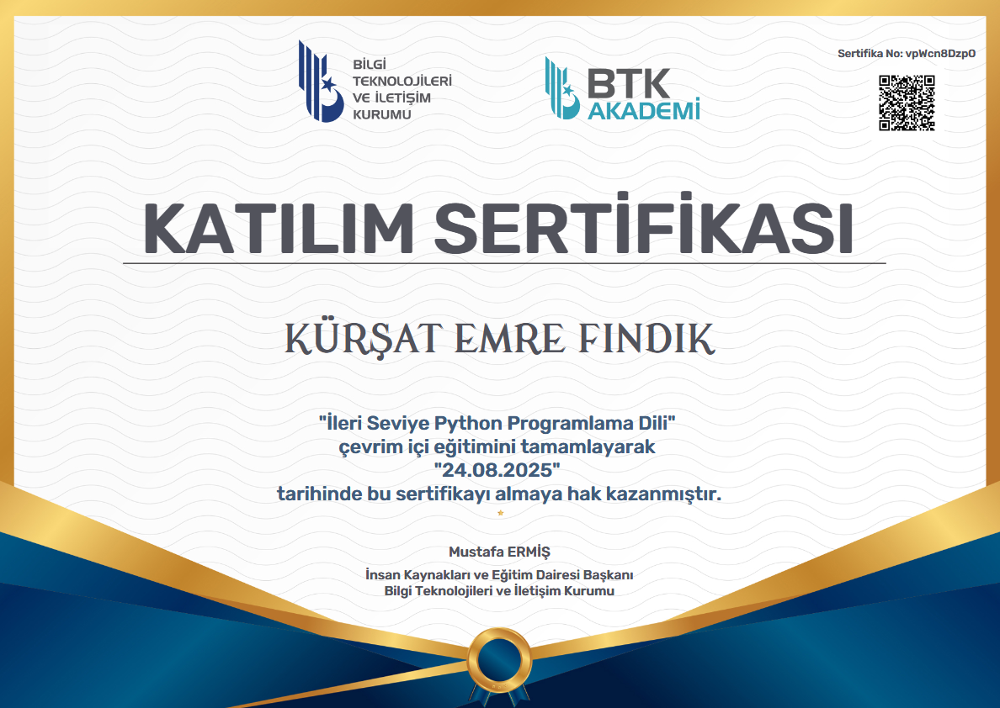
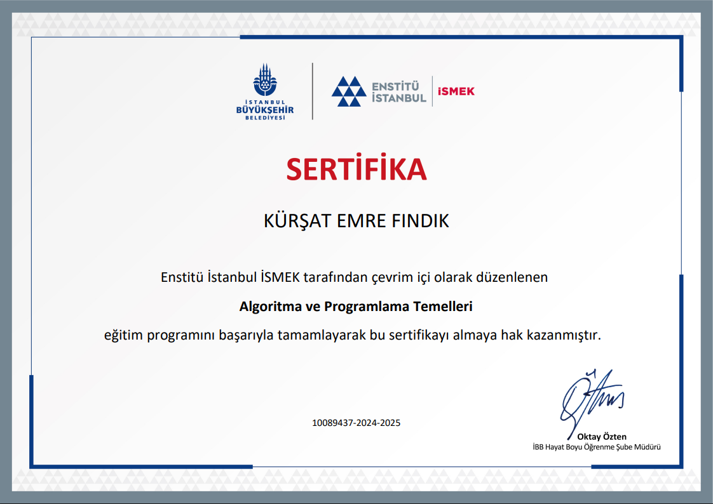
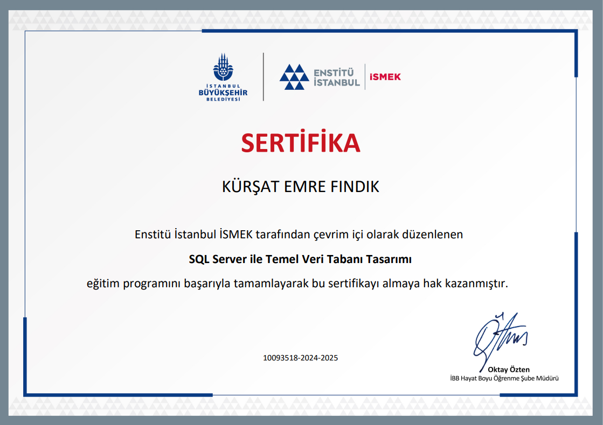
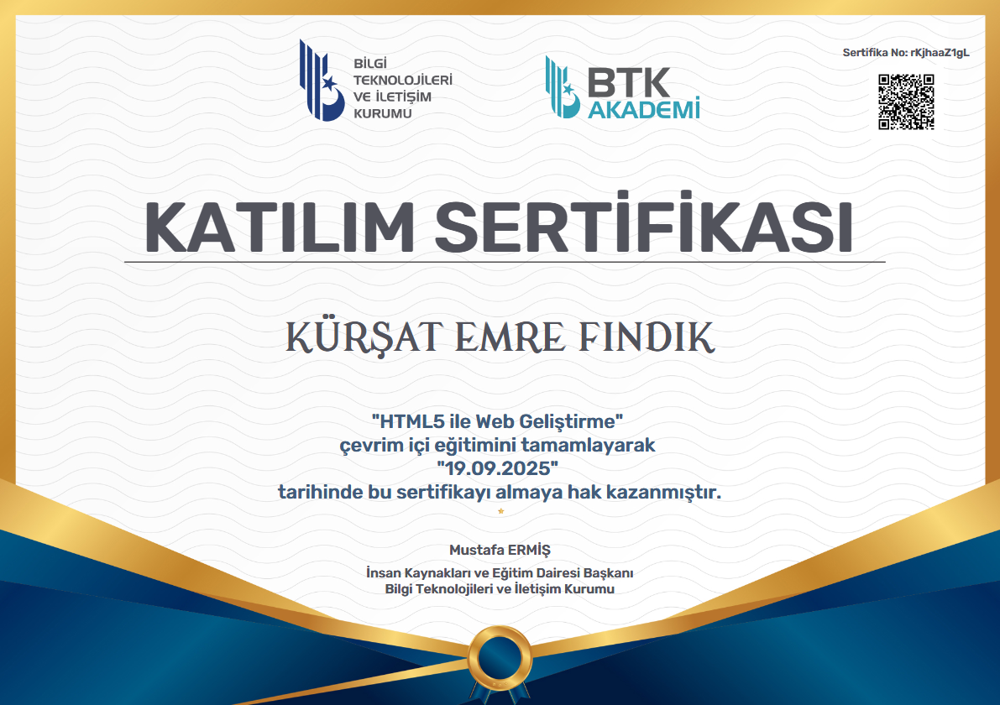

# Welcome! I'm Kürşat Emre Fındık ✌️
<!---->

> "Talk is cheap. Show me the code." – Linus Torvalds

---

## 👨‍💻 About Me  
I strive to improve myself through research, learning new information, communication, group work, and professional ethical principles.  

---

## 🚀 Projects

### FlowKit — PDF, Image & Everyday Tools

  

**🟢 Live on Google Play · Actively maintained**

An Android app I built with **Flutter and Dart**, bringing **29 tools** for images, documents, and everyday tasks into one place.

- **PDF tools:** compress, merge, and split documents.
- **Image tools:** compress, resize, and convert images.
- **OCR & scanning:** text recognition and document scanning with Google ML Kit.
- **My role:** independent developer, from interface design and implementation to testing and Google Play release.

**Tech stack:** Flutter · Dart · Android · Google ML Kit  
**Development:** July 2026 – present  
**Released:** September 30, 2026

### [▶ Get FlowKit on Google Play](https://play.google.com/store/apps/details?id=com.flowkit.app)

📱 View app screenshots

 

  
  
  
  
  

---

## 🛠 Technical Expertise  

### 🌐 Web Development  
  

### 💻 Programming Language  

### 📊 Data Analytics  
  
  

### 🗄 Database Management  
  

---

## 📜 Certificates

| | | |
|:--:|:--:|:--:|
|  |  |  |
|  |   |  |

---

## 📊 GitHub Stats  
  

---

## 📫 Connect with Me  
  
  

---

⭐️ Show some love by starring some of the repositories!
